# ARCHITECTURE.md - Agentic Document Generator
## Final Production-Ready Architecture

---

## 1. Executive Summary

### 1.1 Project Overview
Automated system for converting text-based files (`.txt`, `.log`, `.md`) into professionally formatted `.docx` documents using AI-powered content structuring and `docx-js` for high-quality output.

### 1.2 Core Capabilities
- **Multi-format ingestion** with fidelity preservation
- **AI-driven content structuring** (chapters, sections, hierarchies)
- **Self-healing error correction** with granular fixes
- **Human-in-the-loop** for missing file resolution
- **Production-grade DOCX** generation using docx-js
- **Session isolation** for concurrent operations
- **Comprehensive error handling** with automatic retry

### 1.3 Technology Stack
```yaml
Language: Python 3.13
Package Manager: uv
Orchestration: LangGraph >= 1.0.0
LLM Interface: LiteLLM (langchain-litellm)
Document Generator: docx-js (Node.js via subprocess)
Validation: markdownlint, python-docx (for reading)
State Management: LangGraph MemorySaver
```

---

## 2. Functional Criteria (Complete Reference)

### Core Requirements (FC001-FC008)

**FC001 - Multi-Format Input Support**
- Accept: `.txt`, `.log`, `.md` files
- Validation: UTF-8 encoding, max 100MB per file
- Sanitization: Path traversal protection, binary rejection

**FC002 - Structured Document Generation**
- Organize content into: `Chapters → Sections → Subsections`
- Maintain heading hierarchy (H1 → H2 → H3, no skips)
- Generate intermediate markdown before final DOCX

**FC003 - Incremental Context Awareness**
- Agent reads current document state before appending
- Maintains narrative continuity across chapters
- Tracks: last 100 lines + document outline

**FC004 - Content Fidelity & Asset Migration**
- Preserve code/logs verbatim in code blocks
- NO summarization of technical content
- Copy images to session assets directory
- Maintain original formatting

**FC005 - Granular Error Remediation**
- Identify specific error location (line number)
- Fix ONLY affected section, not entire document
- Specialized handlers per error type

**FC006 - External Dependency Validation (Human-in-the-Loop)**
- Detect references to missing files during parsing
- Pause execution, prompt user: "Upload file or Skip?"
- Resume workflow after decision

**FC007 - File System Discovery**
- List all available files in input directory at startup
- Validate user requests against actual filesystem
- Prevent "file not found" errors before processing

**FC008 - Image/Path Resolution**
- Detect relative image paths in markdown
- Resolve paths or copy to local assets
- Update references to point to session-local copies

### Extended Requirements (FC009-FC017)

**FC009 - Version Checkpointing**
- Save snapshot after each successful chapter
- Enable rollback on conversion failure
- Checkpoint format: `{timestamp}_{label}.md`

**FC010 - Markdown Pre-Validation**
- Run `markdownlint` before conversion
- Catch syntax errors early (unclosed blocks, malformed tables)
- Provide lint errors to agent for preemptive fixes

**FC011 - Output Quality Verification**
- Post-generation validation checks:
  - Heading hierarchy correctness
  - Image rendering verification
  - Code block formatting
  - Table structure integrity

**FC012 - Isolation per Request**
- Unique UUID session directory per request
- Prevents concurrent file conflicts
- Structure: `/docs/sessions/{uuid}/`

**FC013 - Comprehensive Error Classification**
- Categories: Syntax, Encoding, Asset, Structural, Unknown
- Each type routes to specialized handler
- Error metadata extraction (line numbers, context)

**FC014 - Image Asset Management**
- Validate image existence before referencing
- Copy to `./assets/` within session
- Update markdown paths to relative references
- Insert placeholder text if image missing

**FC015 - Observability & Audit Trail**
- Structured JSON logging at each state transition
- Log: tool calls, errors, timestamps, session metadata
- Enables debugging and performance analysis

**FC016 - Input Sanitization**
- Block directory traversal attacks (`../`)
- Restrict to designated input directory
- Reject executable files (`.exe`, `.dll`, `.bin`)
- File size limits enforced

**FC017 - Graceful Degradation**
- Max retry limit: 3 conversion attempts
- On failure: save best-effort markdown + error report
- Provide manual intervention guidance

---

## 3. Architecture Design

### 3.1 System Architecture Diagram

```mermaid
graph TB
    subgraph User_Interface
        Start([User Request])
        HumanInput[👤 Human Input Node]
        End([📄 Final DOCX])
    end
    
    subgraph Initialization
        Sanitize[🔒 Input Sanitizer<br/>FC016]
        CreateSession[🆔 Session Manager<br/>FC012]
        FileDiscovery[📂 File Discovery<br/>FC007]
        ImageScan[🖼️ Image Scanner<br/>FC008]
    end
    
    subgraph Agent_Loop
        Agent[🤖 LLM Agent<br/>Orchestrator]
        Tools[🛠️ Tool Node<br/>Read/Write/Validate]
        MdValidator[✓ MD Validator<br/>FC010]
        Checkpoint[💾 Checkpointer<br/>FC009]
    end
    
    subgraph Conversion_Pipeline
        MdToJson[📋 MD → JSON Parser]
        DocxJs[⚙️ docx-js Converter<br/>Node.js Subprocess]
        QualityCheck[✓ Quality Validator<br/>FC011]
    end
    
    subgraph Error_Handling
        ErrorClass[⚠️ Error Classifier<br/>FC013]
        SyntaxHandler[📝 Syntax Fix]
        EncodingHandler[🔤 Encoding Fix]
        AssetHandler[🖼️ Asset Fix]
        StructuralHandler[📊 Structure Fix]
        Rollback[⏪ Rollback<br/>FC009]
    end
    
    Start --> Sanitize
    Sanitize --> CreateSession
    CreateSession --> FileDiscovery
    FileDiscovery --> ImageScan
    
    ImageScan -->|Missing Files?| HumanInput
    HumanInput --> ImageScan
    ImageScan -->|Ready| Agent
    
    Agent -->|Read/Write| Tools
    Tools --> Agent
    
    Agent -->|Chapter Done| MdValidator
    MdValidator -->|Issues| Agent
    MdValidator -->|Valid| Checkpoint
    Checkpoint --> Agent
    
    Agent -->|External Ref| HumanInput
    
    Agent -->|Complete| MdToJson
    MdToJson --> DocxJs
    
    DocxJs -->|Success| QualityCheck
    QualityCheck -->|Pass| End
    QualityCheck -->|Fail| ErrorClass
    
    DocxJs -->|Error| ErrorClass
    
    ErrorClass -->|Syntax| SyntaxHandler
    ErrorClass -->|Encoding| EncodingHandler
    ErrorClass -->|Asset| AssetHandler
    ErrorClass -->|Structural| StructuralHandler
    
    SyntaxHandler --> Rollback
    EncodingHandler --> Rollback
    AssetHandler --> Rollback
    StructuralHandler --> Rollback
    
    Rollback -->|Retry| Agent
    Rollback -->|Max Retries| End
    
    style Agent fill:#4A90E2,stroke:#2E5C8A,color:#fff
    style DocxJs fill:#50C878,stroke:#2E7D4E,color:#fff
    style ErrorClass fill:#FF6B6B,stroke:#CC5555,color:#fff
    style HumanInput fill:#FFD93D,stroke:#CCA000,color:#000
```



### 3.2 State Flow Diagram


---

## 4. Component Specifications

### 4.1 Input Sanitizer (FC016)

**Purpose**: Security gate preventing malicious input

**Implementation**:
```python
class InputSanitizer:
    ALLOWED_EXTS = {'.txt', '.log', '.md'}
    BLOCKED_EXTS = {'.exe', '.dll', '.so', '.bin', '.sh', '.bat'}
    MAX_FILE_SIZE = 100 * 1024 * 1024  # 100MB
    
    def validate(self, path: str, base_dir: Path) -> Path:
        resolved = Path(path).resolve()
        
        # Security checks
        if not resolved.is_relative_to(base_dir):
            raise SecurityError("Path outside allowed directory")
        
        if resolved.suffix in self.BLOCKED_EXTS:
            raise ValueError("Executable files not allowed")
        
        if resolved.suffix not in self.ALLOWED_EXTS:
            raise ValueError(f"Unsupported format: {resolved.suffix}")
        
        if resolved.stat().st_size > self.MAX_FILE_SIZE:
            raise ValueError("File exceeds size limit")
        
        return resolved
```

**Triggers**: Every user-provided file path
**Output**: Validated, resolved Path object
**Errors**: SecurityError, ValueError, FileNotFoundError

---

### 4.2 Session Manager (FC012)

**Purpose**: Isolate concurrent document generation requests

**Directory Structure**:
```
/docs
  /sessions
    /{uuid-abc123}
      /inputs          # User files copied here
      /assets          # Images stored here
      /checkpoints     # MD snapshots
      /logs            # Session-specific logs
      temp_output.md   # Intermediate markdown
      structure.json   # Document structure for docx-js
      output.docx      # Final output
```

**Implementation**:
```python
class SessionManager:
    def create(self) -> str:
        session_id = str(uuid.uuid4())
        base = Path(f"./docs/sessions/{session_id}")
        
        for subdir in ['inputs', 'assets', 'checkpoints', 'logs']:
            (base / subdir).mkdir(parents=True)
        
        return session_id
    
    def cleanup(self, session_id: str, archive: bool = True):
        path = self.get_path(session_id)
        
        if archive:
            shutil.move(path, f"./docs/archive/{session_id}")
        else:
            shutil.rmtree(path)
```

**Lifecycle**: Create on request → Use during processing → Archive on completion

---

### 4.3 LLM Agent Node (Orchestrator)

**Purpose**: Central decision-making and content generation

**Responsibilities**:
1. Read source files sequentially
2. Determine document structure (chapters, sections)
3. Generate markdown content with proper formatting
4. Detect external file references
5. Request fixes when validation fails
6. Signal completion for conversion

**System Prompt**:
```
You are a professional document generation agent. Your task is to create 
structured Word documents from user-provided text files.

CRITICAL RULES:
1. PRESERVE FIDELITY (FC004): Copy code/logs verbatim in ```language blocks
2. STRUCTURE CONTENT (FC002): Use heading hierarchy # → ## → ###
3. TRACK CONTEXT (FC003): Always read temp file before adding new content
4. NO SUMMARIZATION: Technical content must be copied exactly
5. ASK FOR HELP (FC006): If you see reference to missing file, STOP and ask

WORKFLOW:
1. Call read_file(filename) to get source content
2. Call read_generated_file(lines=100) to see what's already written
3. Determine chapter/section structure
4. Call append_to_markdown(content) with new structured content
5. Call create_checkpoint(label) after each major section
6. If you encounter external reference: INTERRUPT and ask user

FORMATTING GUIDELINES:
- Use # for chapter titles (H1)
- Use ## for main sections (H2)
- Use ### for subsections (H3)
- Wrap ALL code in ```language fences
- Wrap ALL logs in ```text fences
- Use **bold** for emphasis, *italic* for subtle emphasis
- Create tables with proper markdown syntax

EXAMPLE OUTPUT:
# Chapter 1: System Logs Analysis

## Server Startup Sequence

The following logs show the initialization process:

```text
[2025-01-15 08:00:01] INFO: Server starting...
[2025-01-15 08:00:02] INFO: Loading configuration...
[2025-01-15 08:00:03] INFO: Database connected
```

## Configuration Details

The server uses the following settings:

```json
{
  "port": 8080,
  "timeout": 30
}
```
```

**Tool Access**: All tools in Tool Node
**Interruption Points**: External references, validation failures

---

### 4.4 Tool Node (FC001-FC009)

**Available Tools**:

```python
@tool
def list_files(directory: str) -> List[str]:
    """List all files in directory (FC007)"""
    return [f.name for f in Path(directory).iterdir() if f.is_file()]

@tool
def read_file(filename: str, session_id: str) -> str:
    """Read source file content (FC001)"""
    path = Path(f"./docs/sessions/{session_id}/inputs/{filename}")
    return path.read_text(encoding='utf-8')

@tool
def read_generated_file(lines: int, session_id: str) -> str:
    """Read last N lines of temp markdown (FC003)"""
    path = Path(f"./docs/sessions/{session_id}/temp_output.md")
    if not path.exists():
        return ""
    all_lines = path.read_text().split('\n')
    return '\n'.join(all_lines[-lines:])

@tool
def append_to_markdown(content: str, session_id: str) -> str:
    """Append content to temp markdown (FC002, FC004)"""
    path = Path(f"./docs/sessions/{session_id}/temp_output.md")
    with path.open('a', encoding='utf-8') as f:
        f.write(content + "\n\n")
    return f"Appended {len(content)} chars"

@tool
def edit_markdown_line(line_number: int, new_content: str, session_id: str) -> str:
    """Edit specific line (FC005)"""
    path = Path(f"./docs/sessions/{session_id}/temp_output.md")
    lines = path.read_text().split('\n')
    lines[line_number - 1] = new_content
    path.write_text('\n'.join(lines))
    return f"Updated line {line_number}"

@tool
def create_checkpoint(label: str, session_id: str) -> str:
    """Save snapshot (FC009)"""
    timestamp = datetime.now().strftime("%Y%m%d_%H%M%S")
    checkpoint_id = f"{timestamp}_{label}"
    
    src = Path(f"./docs/sessions/{session_id}/temp_output.md")
    dst = Path(f"./docs/sessions/{session_id}/checkpoints/{checkpoint_id}.md")
    
    shutil.copy(src, dst)
    return checkpoint_id

@tool
def rollback_to_checkpoint(checkpoint_id: str, session_id: str) -> str:
    """Restore from checkpoint (FC009)"""
    src = Path(f"./docs/sessions/{session_id}/checkpoints/{checkpoint_id}.md")
    dst = Path(f"./docs/sessions/{session_id}/temp_output.md")
    
    shutil.copy(src, dst)
    return f"Restored {checkpoint_id}"

@tool
def validate_markdown(session_id: str) -> dict:
    """Run markdown linter (FC010)"""
    path = Path(f"./docs/sessions/{session_id}/temp_output.md")
    
    result = subprocess.run(
        ["markdownlint", str(path), "--json"],
        capture_output=True, text=True
    )
    
    if result.returncode == 0:
        return {"valid": True, "issues": []}
    else:
        return {"valid": False, "issues": json.loads(result.stdout)}

def copy_image(source_path: str, session_id: str) -> str:
    """Copy image file to session assets/ and return relative path or placeholder (FC014, Story 3.3).

    Resolves relative paths from session inputs/, validates absolute paths against allowed base.
    Returns './assets/{basename}' on success, or '**[Image Missing: {basename}]**' if missing/invalid.

    Path validation:
    - Relative paths: resolved to session inputs/ directory
    - Absolute paths: validated against allowed_base_path (defaults to inputs dir)
    - URLs (http://, https://): skipped (returns placeholder)
    - Path traversal (.., /, \\): rejected (returns placeholder)

    Args:
        source_path: Path to image file (relative to session inputs/ or absolute)
        session_id: Session ID (injected via tool factory, not from agent)

    Returns:
        './assets/{basename}' on success, or '**[Image Missing: {basename}]**' if missing/invalid
    """
```

---

### 4.5 Markdown Validator (FC010)

**Purpose**: Catch syntax errors before conversion

**Validation Checks**:
- Unclosed code blocks (mismatched ```)
- Malformed tables (column alignment)
- Invalid heading levels (skipped numbers)
- Broken links
- Incorrect list indentation

**Implementation**:
```bash
# Using markdownlint CLI
markdownlint temp_output.md --json
```

**Response to Agent**:
```json
{
  "valid": false,
  "issues": [
    {
      "lineNumber": 45,
      "ruleDescription": "Fenced code blocks should be surrounded by blank lines",
      "errorDetail": "Expected blank line before code block"
    }
  ]
}
```

**Agent Action**: Fix reported issues before proceeding

---

### 4.6 Markdown to JSON Parser

**Purpose**: Convert structured markdown to docx-js compatible JSON

**Input**: `temp_output.md`
**Output**: `structure.json`

**JSON Schema**:
```json
{
  "metadata": {
    "title": "Document Title",
    "author": "Generated by AI",
    "created": "2025-02-11"
  },
  "sections": [
    {
      "type": "heading1",
      "text": "Chapter 1: Introduction",
      "id": "h1_1"
    },
    {
      "type": "paragraph",
      "text": "This is a regular paragraph.",
      "formatting": ["normal"]
    },
    {
      "type": "code_block",
      "language": "python",
      "code": "def hello():\n    print('world')"
    },
    {
      "type": "table",
      "headers": ["Column 1", "Column 2"],
      "rows": [
        ["Data 1", "Data 2"]
      ]
    },
    {
      "type": "image",
      "path": "./assets/diagram.png",
      "alt": "System Diagram",
      "width": 400
    }
  ]
}
```

**Parsing Algorithm**:
1. Split markdown by lines
2. Identify element types (heading, paragraph, code, table, image)
3. Extract content and metadata
4. Build hierarchical JSON structure
5. Resolve image paths to absolute

**Implementation Approach**:
- **Option A**: Use LLM to parse (flexible, handles edge cases)
- **Option B**: Use `mistletoe` library (fast, deterministic)
- **Recommended**: Hybrid - library for structure, LLM for ambiguity

---

### 4.7 docx-js Converter (Primary)

**Purpose**: Generate high-quality DOCX from JSON structure

**Node.js Script** (`converter.js`):
```javascript
const { Document, Packer, Paragraph, TextRun, Table, TableRow, 
        TableCell, ImageRun, HeadingLevel, AlignmentType, 
        BorderStyle, WidthType, LevelFormat } = require('docx');
const fs = require('fs');

// Read structure JSON
const structure = JSON.parse(fs.readFileSync(process.argv[1], 'utf-8'));

// Build document elements
const elements = structure.sections.map(section => {
  switch(section.type) {
    case 'heading1':
      return new Paragraph({
        heading: HeadingLevel.HEADING_1,
        children: [new TextRun({ text: section.text, bold: true })]
      });
    
    case 'heading2':
      return new Paragraph({
        heading: HeadingLevel.HEADING_2,
        children: [new TextRun({ text: section.text, bold: true })]
      });
    
    case 'heading3':
      return new Paragraph({
        heading: HeadingLevel.HEADING_3,
        children: [new TextRun({ text: section.text, bold: true })]
      });
    
    case 'paragraph':
      return new Paragraph({
        children: [new TextRun(section.text)]
      });
    
    case 'code_block':
      // Split code into lines and create separate paragraphs
      return section.code.split('\n').map(line => 
        new Paragraph({
          style: 'Code',
          children: [new TextRun({ text: line, font: 'Courier New' })]
        })
      );
    
    case 'table':
      return new Table({
        width: { size: 9360, type: WidthType.DXA },
        rows: [
          // Header row
          new TableRow({
            children: section.headers.map(h => new TableCell({
              shading: { fill: 'D3D3D3', type: 'clear' },
              children: [new Paragraph({ 
                children: [new TextRun({ text: h, bold: true })] 
              })]
            }))
          }),
          // Data rows
          ...section.rows.map(row => new TableRow({
            children: row.map(cell => new TableCell({
              children: [new Paragraph({ children: [new TextRun(cell)] })]
            }))
          }))
        ]
      });
    
    case 'image':
      const imageBuffer = fs.readFileSync(section.path);
      return new Paragraph({
        children: [
          new ImageRun({
            data: imageBuffer,
            transformation: { width: section.width || 400, height: section.height || 300 }
          })
        ]
      });
    
    default:
      return new Paragraph({ children: [new TextRun('')] });
  }
}).flat(); // Flatten code blocks

// Create document
const doc = new Document({
  styles: {
    default: {
      document: {
        run: { font: 'Arial', size: 24 } // 12pt
      }
    },
    paragraphStyles: [
      {
        id: 'Code',
        name: 'Code Block',
        basedOn: 'Normal',
        run: { font: 'Courier New', size: 20 }, // 10pt
        paragraph: { 
          spacing: { before: 120, after: 120 },
          shading: { fill: 'F5F5F5', type: 'clear' }
        }
      }
    ]
  },
  sections: [{
    properties: {
      page: {
        size: { width: 12240, height: 15840 }, // US Letter
        margin: { top: 1440, right: 1440, bottom: 1440, left: 1440 }
      }
    },
    children: elements
  }]
});

// Write to file
Packer.toBuffer(doc).then(buffer => {
  fs.writeFileSync(process.argv[2], buffer);
  console.log('Document created successfully');
}).catch(err => {
  console.error('Error creating document:', err);
  process.exit(1);
});
```

**Python Integration**:
```python
def convert_to_docx(session_id: str) -> Tuple[bool, Optional[str]]:
    """Convert JSON structure to DOCX using docx-js"""
    session_path = Path(f"./docs/sessions/{session_id}")
    json_path = session_path / "structure.json"
    output_path = session_path / "output.docx"
    
    try:
        result = subprocess.run(
            ['node', 'converter.js', str(json_path), str(output_path)],
            capture_output=True,
            text=True,
            timeout=60
        )
        
        if result.returncode == 0:
            return True, None
        else:
            return False, result.stderr
    
    except subprocess.TimeoutExpired:
        return False, "Conversion timeout (60s exceeded)"
    except Exception as e:
        return False, str(e)
```

---

### 4.8 Error Classifier & Handlers (FC013)

**Error Taxonomy**:

| Type | Examples | Handler |
|------|----------|---------|
| Syntax | Unclosed code block, malformed table | SyntaxHandler |
| Encoding | Invalid UTF-8, special characters | EncodingHandler |
| Asset | Missing image, broken path | AssetHandler |
| Structural | Skipped heading level, invalid hierarchy | StructuralHandler |
| Unknown | Unclassified errors | Escalate to human |

**Classifier Implementation**:
```python
class ErrorType(Enum):
    SYNTAX = "syntax"
    ENCODING = "encoding"
    ASSET = "asset"
    STRUCTURAL = "structural"
    UNKNOWN = "unknown"

class ErrorClassifier:
    @staticmethod
    def classify(error_msg: str) -> Tuple[ErrorType, dict]:
        error_lower = error_msg.lower()
        
        # Extract line number
        line_match = re.search(r'line (\d+)', error_lower)
        line_num = int(line_match.group(1)) if line_match else None
        
        metadata = {
            "line_number": line_num,
            "message": error_msg,
            "timestamp": datetime.now().isoformat()
        }
        
        # Classification logic
        if any(kw in error_lower for kw in ['unclosed', 'malformed', 'table', 'fence']):
            return ErrorType.SYNTAX, metadata
        
        if any(kw in error_lower for kw in ['encoding', 'utf-8', 'decode']):
            return ErrorType.ENCODING, metadata
        
        if any(kw in error_lower for kw in ['image', 'file not found', 'asset']):
            return ErrorType.ASSET, metadata
        
        if any(kw in error_lower for kw in ['heading', 'hierarchy', 'level']):
            return ErrorType.STRUCTURAL, metadata
        
        return ErrorType.UNKNOWN, metadata
```

**Handler Strategies**:

```python
class SyntaxHandler:
    """Fix markdown syntax errors"""
    
    @staticmethod
    def fix_unclosed_code_block(session_id: str, line_num: int) -> str:
        """Add closing fence"""
        # Read file
        path = Path(f"./docs/sessions/{session_id}/temp_output.md")
        content = path.read_text()
        
        # Count fences
        fence_count = content.count('```')
        
        if fence_count % 2 != 0:
            # Add closing fence
            path.write_text(content + '\n```\n')
            return "Added closing code fence"
        
        return "No unclosed fence detected"

class EncodingHandler:
    """Fix character encoding issues"""
    
    @staticmethod
    def fix_invalid_utf8(session_id: str) -> str:
        """Replace invalid UTF-8 with placeholders"""
        path = Path(f"./docs/sessions/{session_id}/temp_output.md")
        
        # Read with error handling
        with path.open('r', encoding='utf-8', errors='replace') as f:
            content = f.read()
        
        # Rewrite cleaned
        path.write_text(content, encoding='utf-8')
        return "Fixed encoding issues"

class AssetHandler:
    """Fix missing image references"""
    
    @staticmethod
    def insert_placeholder(session_id: str, image_name: str) -> str:
        """Replace missing image with text placeholder"""
        path = Path(f"./docs/sessions/{session_id}/temp_output.md")
        content = path.read_text()
        
        # Replace image markdown with placeholder
        old = f""
        new = f"\n**[Image Missing: {image_name}]**\n"
        
        content = content.replace(old, new)
        path.write_text(content)
        
        return f"Inserted placeholder for {image_name}"

class StructuralHandler:
    """Fix document structure issues"""
    
    @staticmethod
    def fix_heading_hierarchy(session_id: str) -> str:
        """Adjust heading levels to prevent skips"""
        path = Path(f"./docs/sessions/{session_id}/temp_output.md")
        lines = path.read_text().split('\n')
        
        prev_level = 0
        fixed_lines = []
        
        for line in lines:
            if line.startswith('#'):
                # Count heading level
                level = len(line.split()[0])
                
                # Fix skip
                if level > prev_level + 1:
                    level = prev_level + 1
                    line = '#' * level + line[level:]
                
                prev_level = level
            
            fixed_lines.append(line)
        
        path.write_text('\n'.join(fixed_lines))
        return "Fixed heading hierarchy"
```

---

### 4.9 Quality Validator (FC011)

**Purpose**: Verify final DOCX meets quality standards

**Validation Checks**:

```python
from docx import Document

class QualityValidator:
    @staticmethod
    def validate(docx_path: Path) -> dict:
        """Run all quality checks"""
        doc = Document(str(docx_path))
        issues = []
        
        # Check 1: Heading hierarchy
        issues.extend(QualityValidator._check_headings(doc))
        
        # Check 2: Images render
        issues.extend(QualityValidator._check_images(doc))
        
        # Check 3: Code blocks formatted
        issues.extend(QualityValidator._check_code_blocks(doc))
        
        # Check 4: Tables present
        issues.extend(QualityValidator._check_tables(doc))
        
        return {
            "pass": len(issues) == 0,
            "issues": issues,
            "score": max(0, 100 - len(issues) * 10)
        }
    
    @staticmethod
    def _check_headings(doc: Document) -> List[str]:
        """Verify heading hierarchy"""
        issues = []
        prev_level = 0
        
        for para in doc.paragraphs:
            if para.style.name.startswith('Heading'):
                level = int(para.style.name.replace('Heading ', ''))
                
                if level > prev_level + 1:
                    issues.append(
                        f"Skipped heading level: H{prev_level} → H{level} "
                        f"at '{para.text[:50]}'"
                    )
                
                prev_level = level
        
        return issues
    
    @staticmethod
    def _check_images(doc: Document) -> List[str]:
        """Verify all images load"""
        issues = []
        
        for rel in doc.part.rels.values():
            if "image" in rel.reltype:
                try:
                    _ = rel.target_part.blob
                except:
                    issues.append(f"Broken image: {rel.target_ref}")
        
        return issues
    
    @staticmethod
    def _check_code_blocks(doc: Document) -> List[str]:
        """Verify code formatting"""
        issues = []
        
        for para in doc.paragraphs:
            if para.style.name == 'Code':
                if not para.runs:
                    continue
                
                font = para.runs[0].font.name
                if font not in ['Courier New', 'Consolas', 'Monaco']:
                    issues.append(
                        f"Code block not monospaced: {para.text[:50]}"
                    )
        
        return issues
    
    @staticmethod
    def _check_tables(doc: Document) -> List[str]:
        """Verify table structure"""
        issues = []
        
        for table in doc.tables:
            if len(table.rows) == 0:
                issues.append("Empty table detected")
                continue
            
            # Check consistent column count
            col_counts = [len(row.cells) for row in table.rows]
            if len(set(col_counts)) > 1:
                issues.append(
                    f"Inconsistent table columns: {col_counts}"
                )
        
        return issues
```

---

### 4.10 Logger (FC015)

**Purpose**: Structured observability for debugging and monitoring

**Implementation**:
```python
import logging
import json
from datetime import datetime

class StructuredLogger:
    def __init__(self, session_id: str):
        self.session_id = session_id
        self.logger = logging.getLogger(f"session.{session_id}")
        
        # File handler
        log_path = Path(f"./docs/sessions/{session_id}/logs/session.jsonl")
        handler = logging.FileHandler(log_path)
        handler.setFormatter(logging.Formatter('%(message)s'))
        
        self.logger.addHandler(handler)
        self.logger.setLevel(logging.INFO)
    
    def log_event(self, event_type: str, **kwargs):
        """Log structured event"""
        event = {
            "timestamp": datetime.now().isoformat(),
            "session_id": self.session_id,
            "event_type": event_type,
            **kwargs
        }
        self.logger.info(json.dumps(event))
    
    def log_state_transition(self, from_state: str, to_state: str, **kwargs):
        """Log state machine transition"""
        self.log_event(
            "state_transition",
            from_state=from_state,
            to_state=to_state,
            **kwargs
        )
    
    def log_tool_call(self, tool_name: str, args: dict, result: any):
        """Log tool invocation"""
        self.log_event(
            "tool_call",
            tool_name=tool_name,
            args=args,
            result=str(result)[:200]  # Truncate
        )
    
    def log_error(self, error_type: str, message: str, **kwargs):
        """Log error occurrence"""
        self.log_event(
            "error",
            error_type=error_type,
            message=message,
            **kwargs
        )
```

**Example Log Output** (`.jsonl`):
```json
{"timestamp":"2025-02-11T10:00:01","session_id":"abc-123","event_type":"state_transition","from_state":"init","to_state":"processing"}
{"timestamp":"2025-02-11T10:00:02","session_id":"abc-123","event_type":"tool_call","tool_name":"read_file","args":{"filename":"log.txt"},"result":"[2025-01-15] Server started..."}
{"timestamp":"2025-02-11T10:00:15","session_id":"abc-123","event_type":"error","error_type":"syntax","message":"Unclosed code block at line 45"}
```

---

## 5. Complete Workflow Implementation

### 5.0 Entry and session lifecycle (Story 1.4)

**Entry owns session lifecycle.** Session is created at entry (after validation); the graph does **not** create a session. The graph starts at `scan_assets` (no "initialize" node that creates a session). Cleanup is **entry-owned**: the entry calls `SessionManager.cleanup(session_id, archive=success)` after `workflow.invoke` returns. No other code path deletes or archives the session.

**Entry flow:**
1. `validate_requested_files(requested_paths, base_dir)` → valid Paths, errors.
2. If no valid files → return `GenerateResult(success=False, validation_errors=errors)`; do not create a session.
3. `session_id = SessionManager.create()`.
4. Copy each valid Path to `get_path(session_id) / "inputs" / path.name` (e.g. `shutil.copy`). **Duplicate destination filenames:** last copy wins (documented).
5. `initial_state = build_initial_state(session_id, input_filenames)`.
6. `result = workflow.invoke(initial_state)`.
7. `SessionManager.cleanup(session_id, archive=(result["status"]=="complete"))`.
8. Return `GenerateResult(success=..., session_id=..., output_path=..., error=..., messages=...)`.

**Graph:** START → scan_assets → END. The first node receives state with `session_id` and `input_files`; it does not create a session.

**Cleanup ownership:** Cleanup runs in exactly one place (entry, after invoke). No cleanup inside the graph.

### 5.1 LangGraph State Definition

```python
from typing import TypedDict, List, Annotated, Literal
import operator

class DocumentState(TypedDict):
    # Session
    session_id: str
    
    # Input
    input_files: List[str]  # Validated file paths
    current_file_index: int
    
    # Processing
    temp_md_path: str
    structure_json_path: str
    output_docx_path: str
    
    # Context
    last_checkpoint_id: str
    current_chapter: int
    document_outline: List[str]  # Chapter titles
    
    # Error Handling
    conversion_attempts: int
    last_error: str
    error_type: str
    retry_count: int
    
    # Human-in-the-Loop
    missing_references: Annotated[List[str], operator.add]
    user_decisions: dict  # {filename: "upload" | "skip"}
    pending_question: str
    
    # Status
    status: Literal[
        "initializing",
        "scanning_assets", 
        "processing",
        "validating",
        "converting",
        "quality_checking",
        "error_handling",
        "complete",
        "failed"
    ]
    
    # Logging
    messages: Annotated[List[str], operator.add]
```

---

### 5.2 Graph Construction

```python
from langgraph.graph import StateGraph, START, END
from langgraph.prebuilt import ToolNode
from langgraph.checkpoint.memory import MemorySaver

def create_document_workflow():
    """Build the complete LangGraph workflow"""
    
    # Initialize graph with state and checkpointer
    workflow = StateGraph(DocumentState)
    memory = MemorySaver()
    
    # ========== NODE DEFINITIONS ==========
    
    workflow.add_node("initialize", initialize_node)
    workflow.add_node("scan_assets", scan_assets_node)
    workflow.add_node("agent", agent_node)
    workflow.add_node("tools", ToolNode(get_all_tools()))
    workflow.add_node("validate_md", validate_markdown_node)
    workflow.add_node("parse_to_json", parse_markdown_to_json_node)
    workflow.add_node("convert_docx", convert_with_docxjs_node)
    workflow.add_node("quality_check", quality_check_node)
    workflow.add_node("error_handler", error_handler_node)
    workflow.add_node("save_results", save_results_node)
    
    # ========== EDGE DEFINITIONS ==========
    
    # Entry point
    workflow.add_edge(START, "initialize")
    
    # Initialization → Asset scanning
    workflow.add_edge("initialize", "scan_assets")
    
    # Asset scanning → Check for missing files (INTERRUPT POINT 1)
    workflow.add_conditional_edges(
        "scan_assets",
        lambda state: "wait" if state["missing_references"] else "continue",
        {
            "wait": "human_input",  # Pause for user
            "continue": "agent"
        }
    )
    
    # Agent → Tools (processing loop)
    workflow.add_edge("agent", "tools")
    
    # Tools → Route based on action
    workflow.add_conditional_edges(
        "tools",
        route_after_tools,
        {
            "agent": "agent",              # Continue processing
            "validate": "validate_md",      # Validate chapter
            "external_ref": "human_input",  # INTERRUPT POINT 2
            "complete": "parse_to_json"     # Move to conversion
        }
    )
    
    # Validation → Back to agent
    workflow.add_conditional_edges(
        "validate_md",
        lambda state: "fix" if not state.get("validation_passed") else "continue",
        {
            "fix": "agent",  # Ask agent to fix issues
            "continue": "agent"  # Continue to next chapter
        }
    )
    
    # Parsing → Conversion
    workflow.add_edge("parse_to_json", "convert_docx")
    
    # Conversion → Check result
    workflow.add_conditional_edges(
        "convert_docx",
        lambda state: "success" if state.get("conversion_success") else "error",
        {
            "success": "quality_check",
            "error": "error_handler"
        }
    )
    
    # Quality check → Finalize or fix
    workflow.add_conditional_edges(
        "quality_check",
        lambda state: "pass" if state.get("quality_passed") else "fail",
        {
            "pass": "save_results",
            "fail": "error_handler"
        }
    )
    
    # Error handler → Retry or give up
    workflow.add_conditional_edges(
        "error_handler",
        should_retry_conversion,
        {
            "retry": "agent",
            "fail": "save_results"
        }
    )
    
    # Save results → End
    workflow.add_edge("save_results", END)
    
    # Compile with checkpointer for human-in-the-loop
    return workflow.compile(checkpointer=memory)
```

---

### 5.3 Node Implementations

```python
# ========== INITIALIZATION ==========

def initialize_node(state: DocumentState) -> DocumentState:
    """Phase 0: Setup session and sanitize inputs (FC016, FC012)"""
    
    # Create session
    session_mgr = SessionManager()
    session_id = session_mgr.create()
    
    # Initialize logger
    logger = StructuredLogger(session_id)
    logger.log_event("session_created")
    
    # Sanitize input paths
    sanitizer = InputSanitizer()
    validated_files = []
    
    for file_path in state.get("input_files", []):
        try:
            valid_path = sanitizer.validate(file_path, Path("./docs"))
            
            # Copy to session inputs
            session_path = session_mgr.get_path(session_id)
            dest = session_path / "inputs" / valid_path.name
            shutil.copy(valid_path, dest)
            
            validated_files.append(valid_path.name)
            
        except Exception as e:
            logger.log_error("validation_failed", str(e), file=file_path)
            return {
                **state,
                "status": "failed",
                "messages": [f"File validation failed: {e}"]
            }
    
    logger.log_event("files_validated", count=len(validated_files))
    
    return {
        **state,
        "session_id": session_id,
        "input_files": validated_files,
        "current_file_index": 0,
        "current_chapter": 0,
        "conversion_attempts": 0,
        "retry_count": 0,
        "status": "initializing",
        "messages": [f"Session {session_id} initialized with {len(validated_files)} files"]
    }

# ========== ASSET SCANNING ==========

def scan_assets_node(state: DocumentState) -> DocumentState:
    """Phase 1: Scan for images and external references (FC008, FC014)"""
    
    session_id = state["session_id"]
    logger = StructuredLogger(session_id)
    session_path = Path(f"./docs/sessions/{session_id}")
    
    logger.log_state_transition("initializing", "scanning_assets")
    
    missing_refs = []
    
    # Scan each input file for image references
    for filename in state["input_files"]:
        file_path = session_path / "inputs" / filename
        content = file_path.read_text()
        
        # Find markdown image syntax: 
        image_pattern = r'!\[.*?\]\((.*?)\)'
        image_refs = re.findall(image_pattern, content)
        
        for img_path in image_refs:
            # Check if image exists
            if img_path.startswith('http'):
                continue  # Skip URLs
            
            resolved = Path(img_path).resolve()
            
            if not resolved.exists():
                missing_refs.append(str(resolved))
                logger.log_event("missing_image", path=img_path, file=filename)
            else:
                # Copy to assets
                dest = session_path / "assets" / resolved.name
                shutil.copy(resolved, dest)
                logger.log_event("image_copied", source=img_path, dest=dest.name)
    
    if missing_refs:
        return {
            **state,
            "missing_references": missing_refs,
            "status": "scanning_assets",
            "pending_question": f"Missing images: {', '.join(missing_refs)}. Upload or skip?",
            "messages": [f"Found {len(missing_refs)} missing images"]
        }
    else:
        return {
            **state,
            "status": "processing",
            "messages": ["All assets validated"]
        }

# ========== AGENT ==========

def agent_node(state: DocumentState) -> DocumentState:
    """Phase 2: LLM processes files and generates content (FC001-FC006)"""
    
    session_id = state["session_id"]
    logger = StructuredLogger(session_id)
    
    logger.log_state_transition(state["status"], "processing")
    
    # Initialize LLM
    from langchain_litellm import ChatLiteLLM
    
    llm = ChatLiteLLM(
        model="gpt-4",  # or claude-3-5-sonnet-20241022
        temperature=0.3
    )
    
    # Build prompt
    current_file = state["input_files"][state["current_file_index"]]
    
    prompt = f"""You are processing file: {current_file}
    
Current progress:
- Chapter: {state['current_chapter']}
- Session: {state['session_id']}

Your tasks:
1. Call read_file('{current_file}') to get content
2. Call read_generated_file(lines=100) to see what's written
3. Structure content into chapters with proper headings
4. Call append_to_markdown() to add new content
5. Call create_checkpoint() after each chapter
6. If you see external file reference, STOP and interrupt

Remember: Preserve all code/logs verbatim in ``` blocks!
"""
    
    # Invoke LLM with tools
    from langgraph.prebuilt import create_react_agent
    
    tools = get_all_tools()
    agent = create_react_agent(llm, tools)
    
    result = agent.invoke({
        "messages": [{"role": "user", "content": prompt}]
    })
    
    # Check for external references in result
    if "external" in result["messages"][-1]["content"].lower():
        logger.log_event("external_reference_detected")
        return {
            **state,
            "pending_question": "External file referenced. Continue or upload?",
            "messages": ["Detected external reference - pausing"]
        }
    
    # Update state
    return {
        **state,
        "current_chapter": state["current_chapter"] + 1,
        "status": "processing",
        "messages": [f"Processed chapter {state['current_chapter'] + 1}"]
    }

# ========== VALIDATION ==========

def validate_markdown_node(state: DocumentState) -> DocumentState:
    """Phase 3: Validate generated markdown (FC010)"""
    
    session_id = state["session_id"]
    logger = StructuredLogger(session_id)
    
    logger.log_state_transition("processing", "validating")
    
    # Run markdownlint
    md_path = Path(f"./docs/sessions/{session_id}/temp_output.md")
    
    result = subprocess.run(
        ["markdownlint", str(md_path), "--json"],
        capture_output=True,
        text=True
    )
    
    if result.returncode == 0:
        logger.log_event("validation_passed")
        return {
            **state,
            "validation_passed": True,
            "status": "processing",
            "messages": ["Markdown validation passed"]
        }
    else:
        issues = json.loads(result.stdout)
        logger.log_event("validation_failed", issues=issues)
        
        return {
            **state,
            "validation_passed": False,
            "last_error": f"Validation issues: {issues}",
            "status": "processing",
            "messages": [f"Validation found {len(issues)} issues"]
        }

# ========== MARKDOWN TO JSON ==========

def parse_markdown_to_json_node(state: DocumentState) -> DocumentState:
    """Phase 4: Convert markdown to JSON structure for docx-js"""
    
    session_id = state["session_id"]
    logger = StructuredLogger(session_id)
    
    logger.log_state_transition("processing", "converting")
    
    md_path = Path(f"./docs/sessions/{session_id}/temp_output.md")
    json_path = Path(f"./docs/sessions/{session_id}/structure.json")
    
    # Parse markdown using mistletoe or LLM
    from mistletoe import Document as MdDoc
    from mistletoe.ast_renderer import ASTRenderer
    
    with md_path.open('r') as f:
        md_ast = MdDoc(f)
    
    # Convert AST to our JSON schema
    structure = {
        "metadata": {
            "title": "Generated Document",
            "author": "AI Agent",
            "created": datetime.now().isoformat()
        },
        "sections": []
    }
    
    # Walk AST and build sections
    for node in md_ast.children:
        if node.__class__.__name__ == 'Heading':
            structure["sections"].append({
                "type": f"heading{node.level}",
                "text": node.children[0].content
            })
        elif node.__class__.__name__ == 'Paragraph':
            structure["sections"].append({
                "type": "paragraph",
                "text": ''.join([c.content for c in node.children])
            })
        elif node.__class__.__name__ == 'CodeFence':
            structure["sections"].append({
                "type": "code_block",
                "language": node.language,
                "code": node.children[0].content
            })
        # ... handle tables, images, etc.
    
    # Write JSON
    json_path.write_text(json.dumps(structure, indent=2))
    
    logger.log_event("json_created", sections=len(structure["sections"]))
    
    return {
        **state,
        "structure_json_path": str(json_path),
        "status": "converting",
        "messages": ["Markdown parsed to JSON"]
    }

# ========== DOCX CONVERSION ==========

def convert_with_docxjs_node(state: DocumentState) -> DocumentState:
    """Phase 5: Generate DOCX using docx-js (PRIMARY CONVERTER)"""
    
    session_id = state["session_id"]
    logger = StructuredLogger(session_id)
    
    json_path = state["structure_json_path"]
    output_path = Path(f"./docs/sessions/{session_id}/output.docx")
    
    logger.log_event("conversion_started", attempt=state["conversion_attempts"] + 1)
    
    try:
        # Run Node.js converter
        result = subprocess.run(
            ['node', 'converter.js', json_path, str(output_path)],
            capture_output=True,
            text=True,
            timeout=120  # 2 min timeout
        )
        
        if result.returncode == 0:
            logger.log_event("conversion_success")
            
            return {
                **state,
                "conversion_success": True,
                "output_docx_path": str(output_path),
                "status": "quality_checking",
                "messages": ["DOCX generated successfully"]
            }
        else:
            logger.log_error("conversion_failed", result.stderr)
            
            return {
                **state,
                "conversion_success": False,
                "last_error": result.stderr,
                "conversion_attempts": state["conversion_attempts"] + 1,
                "status": "error_handling",
                "messages": [f"Conversion failed: {result.stderr}"]
            }
    
    except subprocess.TimeoutExpired:
        logger.log_error("conversion_timeout", "Exceeded 120s")
        
        return {
            **state,
            "conversion_success": False,
            "last_error": "Conversion timeout",
            "conversion_attempts": state["conversion_attempts"] + 1,
            "status": "error_handling",
            "messages": ["Conversion timeout"]
        }

# ========== QUALITY CHECK ==========

def quality_check_node(state: DocumentState) -> DocumentState:
    """Phase 6: Validate output quality (FC011)"""
    
    session_id = state["session_id"]
    logger = StructuredLogger(session_id)
    
    logger.log_state_transition("converting", "quality_checking")
    
    docx_path = Path(state["output_docx_path"])
    
    # Run quality validation
    validator = QualityValidator()
    result = validator.validate(docx_path)
    
    logger.log_event("quality_check_completed", **result)
    
    if result["pass"]:
        return {
            **state,
            "quality_passed": True,
            "status": "complete",
            "messages": [f"Quality check passed (score: {result['score']})"]
        }
    else:
        return {
            **state,
            "quality_passed": False,
            "last_error": f"Quality issues: {result['issues']}",
            "status": "error_handling",
            "messages": [f"Quality check failed: {len(result['issues'])} issues"]
        }

# ========== ERROR HANDLING ==========

def error_handler_node(state: DocumentState) -> DocumentState:
    """Phase 7: Classify and fix errors (FC013, FC005)"""
    
    session_id = state["session_id"]
    logger = StructuredLogger(session_id)
    
    logger.log_state_transition(state["status"], "error_handling")
    
    # Classify error
    classifier = ErrorClassifier()
    error_type, metadata = classifier.classify(state["last_error"])
    
    logger.log_event("error_classified", type=error_type.value, **metadata)
    
    # Route to handler
    if error_type == ErrorType.SYNTAX:
        fix_result = SyntaxHandler.fix_unclosed_code_block(
            session_id, metadata.get("line_number")
        )
    elif error_type == ErrorType.ENCODING:
        fix_result = EncodingHandler.fix_invalid_utf8(session_id)
    elif error_type == ErrorType.ASSET:
        fix_result = AssetHandler.insert_placeholder(
            session_id, "missing_image.png"
        )
    elif error_type == ErrorType.STRUCTURAL:
        fix_result = StructuralHandler.fix_heading_hierarchy(session_id)
    else:
        fix_result = "Unknown error - manual intervention needed"
    
    logger.log_event("error_fix_attempted", result=fix_result)
    
    # Update retry count
    new_retry = state["retry_count"] + 1
    
    return {
        **state,
        "error_type": error_type.value,
        "retry_count": new_retry,
        "messages": [f"Error fix attempted: {fix_result}"]
    }

# ========== FINALIZATION ==========

def save_results_node(state: DocumentState) -> DocumentState:
    """Phase 8: Save final output and cleanup (FC017)"""
    
    session_id = state["session_id"]
    logger = StructuredLogger(session_id)
    
    if state["status"] == "failed" or state["retry_count"] >= 3:
        # Save failed state (FC017)
        logger.log_event("session_failed", retries=state["retry_count"])
        
        md_path = Path(f"./docs/sessions/{session_id}/temp_output.md")
        failed_path = Path(f"./docs/sessions/{session_id}/FAILED_conversion.md")
        
        shutil.copy(md_path, failed_path)
        
        # Create error report
        report = f"""
# Conversion Failure Report

Session: {session_id}
Attempts: {state['retry_count']}
Last Error: {state.get('last_error', 'Unknown')}
Error Type: {state.get('error_type', 'Unknown')}

## Recommendations:
1. Check temp_output.md for syntax errors
2. Verify all image paths are valid
3. Review heading hierarchy
4. Contact support with session ID
"""
        
        report_path = Path(f"./docs/sessions/{session_id}/ERROR_REPORT.txt")
        report_path.write_text(report)
        
        return {
            **state,
            "status": "failed",
            "messages": ["Session failed - error report generated"]
        }
    
    else:
        # Success - archive session
        logger.log_event("session_completed")
        
        SessionManager().cleanup(session_id, archive=True)
        
        return {
            **state,
            "status": "complete",
            "messages": ["Document generation complete"]
        }

# ========== ROUTING FUNCTIONS ==========

def route_after_tools(state: DocumentState) -> str:
    """Decide next step after tool execution"""
    
    # Check if agent called checkpoint (chapter complete)
    if state["last_checkpoint_id"]:
        return "validate"
    
    # Check if external reference detected
    if state.get("pending_question"):
        return "external_ref"
    
    # Check if all files processed
    if state["current_file_index"] >= len(state["input_files"]) - 1:
        return "complete"
    
    # Continue processing
    return "agent"

def should_retry_conversion(state: DocumentState) -> str:
    """Decide whether to retry or fail"""
    
    if state["retry_count"] >= 3:
        return "fail"
    else:
        return "retry"
```

---

### 5.4 Entry Point & Execution

```python
# main.py

from pathlib import Path
from typing import List

def generate_document(input_files: List[str]) -> dict:
    """
    Main entry point for document generation
    
    Args:
        input_files: List of file paths to process
    
    Returns:
        Result dictionary with status and output path
    """
    
    # Create workflow
    workflow = create_document_workflow()
    
    # Initial state
    initial_state = {
        "input_files": input_files,
        "status": "initializing"
    }
    
    # Run workflow with interrupts for human input
    config = {"configurable": {"thread_id": "main"}}
    
    # Execute
    try:
        result = workflow.invoke(initial_state, config)
        
        if result["status"] == "complete":
            return {
                "success": True,
                "output_path": result["output_docx_path"],
                "session_id": result["session_id"],
                "messages": result["messages"]
            }
        else:
            return {
                "success": False,
                "error": result.get("last_error"),
                "session_id": result["session_id"],
                "messages": result["messages"]
            }
    
    except Exception as e:
        return {
            "success": False,
            "error": str(e),
            "messages": [f"Fatal error: {e}"]
        }

# CLI Interface
if __name__ == "__main__":
    import sys
    
    if len(sys.argv) < 2:
        print("Usage: python main.py <file1> <file2> ...")
        sys.exit(1)
    
    files = sys.argv[1:]
    result = generate_document(files)
    
    if result["success"]:
        print(f"✅ Document generated: {result['output_path']}")
    else:
        print(f"❌ Generation failed: {result['error']}")
```

---

## 6. Directory Structure (Final)

```
/project-root
├── main.py                      # Entry point
├── graph.py                     # LangGraph workflow
├── nodes.py                     # Node implementations
├── tools.py                     # Tool definitions
├── converter.js                 # docx-js Node script
├── package.json                 # Node dependencies
├── requirements.txt             # Python dependencies
│
├── utils/
│   ├── sanitizer.py            # Input validation (FC016)
│   ├── session_manager.py      # Session handling (FC012)
│   └── logger.py               # Structured logging (FC015)
│
├── validators/
│   ├── markdown_validator.py   # MD linting (FC010)
│   └── docx_validator.py       # Quality checks (FC011)
│
├── error_handlers/
│   ├── classifier.py           # Error classification (FC013)
│   ├── syntax_handler.py       # Syntax fixes
│   ├── encoding_handler.py     # Encoding fixes
│   ├── asset_handler.py        # Image/asset fixes
│   └── structural_handler.py   # Structure fixes
│
├── parsers/
│   └── md_to_json.py           # Markdown → JSON conversion
│
├── docs/
│   ├── sessions/               # Active sessions
│   │   └── {uuid}/
│   │       ├── inputs/
│   │       ├── assets/
│   │       ├── checkpoints/
│   │       ├── logs/
│   │       ├── temp_output.md
│   │       ├── structure.json
│   │       └── output.docx
│   │
│   └── archive/                # Completed sessions
│       └── {uuid}/
│
├── tests/
│   ├── test_sanitizer.py
│   ├── test_session_manager.py
│   ├── test_workflow.py
│   └── test_converters.py
│
└── ARCHITECTURE.md             # This file
```

---

## 7. Installation & Setup

### 7.1 Python Environment

```bash
# Create project
mkdir agentic-doc-generator
cd agentic-doc-generator

# Initialize with uv
uv init
uv venv
source .venv/bin/activate  # Linux/Mac
# .venv\Scripts\activate   # Windows

# Install Python dependencies
uv add langgraph litellm python-docx markdownlint mistletoe

# Create requirements.txt
uv pip freeze > requirements.txt
```

### 7.2 Node.js Setup

```bash
# Initialize Node project
npm init -y

# Install docx-js
npm install docx

# Verify installation
node -e "const {Document} = require('docx'); console.log('docx-js installed')"
```

### 7.3 System Dependencies

```bash
# Install markdownlint CLI
npm install -g markdownlint-cli

# Verify
markdownlint --version
```

---

## 8. Configuration

### 8.1 Environment Variables

```bash
# .env
LLM_PROVIDER=openai
OPENAI_API_KEY=sk-...
# or
LLM_PROVIDER=anthropic
ANTHROPIC_API_KEY=sk-ant-...

MAX_FILE_SIZE=104857600  # 100MB
MAX_RETRY_ATTEMPTS=3
SESSION_TIMEOUT=3600     # 1 hour
LOG_LEVEL=INFO
```

### 8.2 LiteLLM Configuration

```python
# config.py
import os
from litellm import completion

def get_llm_config():
    return {
        "model": os.getenv("LLM_MODEL", "gpt-4"),
        "temperature": 0.3,
        "max_tokens": 4000,
        "timeout": 60
    }
```

---

## 9. Testing Strategy

### 9.1 Unit Tests

```python
# tests/test_sanitizer.py
import pytest
from utils.sanitizer import InputSanitizer

def test_block_directory_traversal():
    sanitizer = InputSanitizer()
    with pytest.raises(SecurityError):
        sanitizer.validate("../../etc/passwd", Path("./docs"))

def test_block_executables():
    sanitizer = InputSanitizer()
    with pytest.raises(ValueError):
        sanitizer.validate("./docs/malware.exe", Path("./docs"))
```

### 9.2 Integration Tests

```python
# tests/test_workflow.py
def test_full_conversion():
    # Setup
    test_file = create_test_file("test.txt", "# Title\nContent")
    
    # Run
    result = generate_document([test_file])
    
    # Verify
    assert result["success"]
    assert Path(result["output_path"]).exists()
    
    # Validate DOCX
    doc = Document(result["output_path"])
    assert doc.paragraphs[0].text == "Title"
```

### 9.3 Error Injection Tests

```python
def test_unclosed_code_block_recovery():
    # Create file with unclosed code block
    test_content = "# Test\n```python\nprint('hello')\n# Missing closing fence"
    
    result = generate_document([test_content])
    
    # Should auto-fix
    assert result["success"]
    assert "code fence" in result["messages"]
```

---

## 10. Deployment Checklist

### Pre-Production
- [ ] All unit tests passing
- [ ] Integration tests passing
- [ ] Error injection tests passing
- [ ] Security audit completed
- [ ] Performance benchmarks established
- [ ] Documentation complete
- [ ] API limits configured

### Production
- [ ] Environment variables set
- [ ] File permissions configured
- [ ] Session cleanup cron job scheduled
- [ ] Monitoring dashboards created
- [ ] Error alerting configured
- [ ] Backup strategy implemented
- [ ] Rate limiting enabled
- [ ] Load balancing configured (if needed)

---

## 11. Monitoring & Observability

### 11.1 Metrics to Track

```python
# Key Performance Indicators (KPIs)
metrics = {
    "conversion_success_rate": 0.95,  # Target: 95%
    "average_processing_time": 30,    # Target: <30s
    "error_recovery_rate": 0.80,      # Target: 80%
    "quality_score_avg": 90,          # Target: >90
}
```

### 11.2 Logging Aggregation

```bash
# Aggregate session logs
cat docs/sessions/*/logs/session.jsonl | jq -s '.'

# Error analysis
cat docs/sessions/*/logs/session.jsonl | jq 'select(.event_type=="error")' | jq -s 'group_by(.error_type)'
```

### 11.3 Alerting Rules

```yaml
alerts:
  - name: HighErrorRate
    condition: error_rate > 0.10  # >10% errors
    action: email_admin
  
  - name: SlowConversion
    condition: avg_processing_time > 60  # >60s
    action: slack_notification
  
  - name: DiskSpaceLow
    condition: disk_usage > 0.80  # >80% full
    action: cleanup_old_sessions
```

---

## 12. Troubleshooting Guide

### Common Issues

**Issue 1: "File not found" errors**
```
Cause: Path validation failing
Fix: Check file exists in ./docs and permissions are correct
Debug: Enable DEBUG logging to see sanitizer checks
```

**Issue 2: Conversion timeout**
```
Cause: Large files or complex tables
Fix: Increase timeout in convert_with_docxjs_node (default: 120s)
Optimize: Split large documents into chapters
```

**Issue 3: Image not rendering in DOCX**
```
Cause: Invalid image path or format
Fix: Verify image copied to assets/ directory
Check: Run quality_check_node to identify broken images
```

**Issue 4: Heading hierarchy violations**
```
Cause: Agent skipping heading levels
Fix: StructuralHandler automatically fixes this
Prevention: Improve agent prompting to follow hierarchy rules
```

---

## 13. Performance Optimization

### 13.1 Caching Strategy

```python
# Cache parsed file content
from functools import lru_cache

@lru_cache(maxsize=100)
def parse_markdown(content: str) -> dict:
    # Expensive parsing operation
    return parsed_structure
```

### 13.2 Parallel Processing

```python
# Process multiple files concurrently
from concurrent.futures import ThreadPoolExecutor

def process_multiple_files(file_list):
    with ThreadPoolExecutor(max_workers=4) as executor:
        futures = [executor.submit(read_file, f) for f in file_list]
        results = [f.result() for f in futures]
    return results
```

### 13.3 Resource Limits

```python
# Prevent resource exhaustion
MAX_CONCURRENT_SESSIONS = 10
MAX_FILE_SIZE = 100 * 1024 * 1024  # 100MB
MAX_TOTAL_SIZE = 500 * 1024 * 1024  # 500MB per request
```

---

## 14. Security Best Practices

### 14.1 Input Validation
- ✅ Sanitize all file paths
- ✅ Validate file types (whitelist only)
- ✅ Enforce size limits
- ✅ Scan for malicious content

### 14.2 Sandboxing
- ✅ Isolate sessions with UUID directories
- ✅ Run Node.js subprocess with limited permissions
- ✅ Timeout all external processes
- ✅ Clean up temp files after completion

### 14.3 Data Privacy
- ✅ No logging of file content
- ✅ Secure session IDs (UUID4)
- ✅ Auto-archive old sessions
- ✅ Optional encryption at rest

---

## 15. Future Enhancements

### Planned Features
1. **Real-time collaboration**: Multiple users editing same document
2. **Template library**: Pre-defined document structures
3. **Version control**: Git-like history for documents
4. **Export formats**: PDF, HTML, LaTeX support
5. **AI suggestions**: Style improvements, grammar checking
6. **Cloud storage**: Direct upload to Google Drive, Dropbox
7. **API endpoint**: RESTful API for external integrations
8. **Web UI**: Browser-based interface

### Research Areas
- **Incremental conversion**: Convert chapters as generated (streaming)
- **Multi-language support**: I18n for document metadata
- **Custom styling**: User-defined themes and templates
- **OCR integration**: Process scanned documents
- **Voice input**: Dictate content directly

---

## APPENDIX A: Complete Functional Criteria Matrix

| ID | Requirement | Implementation | Status |
|---|---|---|---|
| FC001 | Multi-Format Input | InputSanitizer validates .txt, .log, .md | ✅ |
| FC002 | Structured Generation | Agent creates heading hierarchy in MD | ✅ |
| FC003 | Context Awareness | read_generated_file() tool | ✅ |
| FC004 | Content Fidelity | Code blocks preserved verbatim | ✅ |
| FC005 | Granular Error Fix | edit_markdown_line() tool | ✅ |
| FC006 | Human-in-the-Loop | LangGraph interrupts | ✅ |
| FC007 | File Discovery | list_files() tool | ✅ |
| FC008 | Image Resolution | scan_assets_node + copy_image() | ✅ |
| FC009 | Checkpointing | create_checkpoint() + rollback() | ✅ |
| FC010 | MD Validation | validate_markdown_node (markdownlint) | ✅ |
| FC011 | Quality Verification | QualityValidator class | ✅ |
| FC012 | Session Isolation | SessionManager (UUID dirs) | ✅ |
| FC013 | Error Classification | ErrorClassifier + specialized handlers | ✅ |
| FC014 | Asset Management | copy_image() + assets/ directory | ✅ |
| FC015 | Observability | StructuredLogger (JSON logs) | ✅ |
| FC016 | Input Sanitization | InputSanitizer (security checks) | ✅ |
| FC017 | Graceful Degradation | save_results_node (error reports) | ✅ |

---

## APPENDIX B: API Reference

### Main Function

```python
def generate_document(
    input_files: List[str],
    output_format: str = "docx",
    template: Optional[str] = None,
    metadata: Optional[dict] = None
) -> dict:
    """
    Generate document from input files
    
    Args:
        input_files: List of file paths to process
        output_format: Target format (default: "docx")
        template: Optional template name
        metadata: Optional document metadata
    
    Returns:
        {
            "success": bool,
            "output_path": str,
            "session_id": str,
            "messages": List[str],
            "error": Optional[str]
        }
    """
```

### Tool Functions

```python
# File Operations
list_files(directory: str) -> List[str]
read_file(filename: str, session_id: str) -> str
read_generated_file(lines: int, session_id: str) -> str

# Content Generation
append_to_markdown(content: str, session_id: str) -> str
edit_markdown_line(line_number: int, new_content: str, session_id: str) -> str

# Checkpointing
create_checkpoint(label: str, session_id: str) -> str
rollback_to_checkpoint(checkpoint_id: str, session_id: str) -> str

# Validation
validate_markdown(session_id: str) -> dict

# Assets
copy_image(source_path: str, session_id: str) -> str
```

---

## APPENDIX C: Error Codes

| Code | Type | Description | Auto-Fix |
|---|---|---|---|
| E001 | Syntax | Unclosed code block | ✅ |
| E002 | Syntax | Malformed table | ⚠️ Partial |
| E003 | Encoding | Invalid UTF-8 | ✅ |
| E004 | Asset | Missing image | ✅ (placeholder) |
| E005 | Asset | Broken path | ✅ (resolve) |
| E006 | Structural | Skipped heading | ✅ |
| E007 | Structural | Invalid hierarchy | ✅ |
| E008 | Conversion | docx-js timeout | ❌ Manual |
| E009 | Conversion | Node.js error | ❌ Manual |
| E999 | Unknown | Unclassified | ❌ Manual |

---

*This architecture document serves as the complete reference for implementing an AI-powered document generation system with production-grade quality, security, and reliability.*