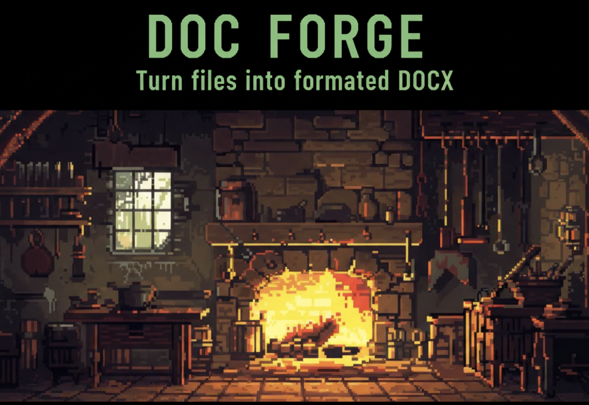

# Doc-Forg – Turn your documents into beautiful DOCX files



Doc-Forg helps you quickly combine multiple markdown/text documents into one polished DOCX file — right from a nice terminal interface (TUI).

### ✨ Quick Start in 30 seconds

**Requirements**  
- Python 3.11 or newer  
- Node.js 18 or newer  
- uv (Python package manager – [get it here](https://github.com/astral-sh/uv))  

**One-time setup** (do this once in the project folder):
```bash
# Install Python dependencies
uv sync

# Install the DOCX converter (needs to be done only once)
cd converter
npm install
cd ..
```

**Launch the app**
```bash
uv run -m src.main
```
→ You'll see a friendly terminal interface (TUI)

### Creating a New Document (most common workflow)

1. **Give your document a title**  
   Type: `/title Your Amazing Report`

2. **Add sections** (you can add as many as you want)  
   - Introduction:  `/intro ID`  
   - Chapter 1:      `/chapter ID`  
   - Another part:   `/chapter ID`  
   (replace with your actual document IDs)

3. **Generate & preview the result**  
   Type: `/forge`

4. **Preview mode appears**  
   → You'll see the proposed combined markdown file  
   → You can review it before anything is created

5. **What to do next?**  
   - Looks good?               → type `/accept`  
   - Not happy?                → type `/cancel`  
   - Want to tweak something?  → open the file shown in the path with your favorite editor (VS Code, vim, etc.), make changes, save, and type `/accept`

### Continuing / Updating an Existing Document

Already have a `document.md` created with Doc-Forg? Great!

1. Load it back:  
   Type: `/import`

2. Add more chapters if needed:  
   `/chapter 101`  
   `/chapter 202`  
   etc.

3. Generate updated version:  
   `/forge` → review → `/accept` or `/cancel`

That's it!  

----

### Enjoy building documents without copy-pasting hell.

Tips:
>- All commands start with `/` (slash)
>- You can type `/help` anytime for available commands

----
Happy forging! 📄➜✨
